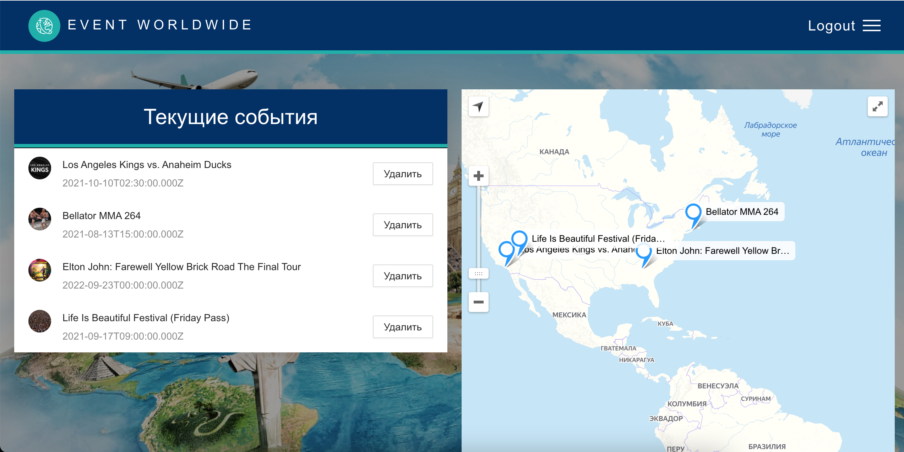
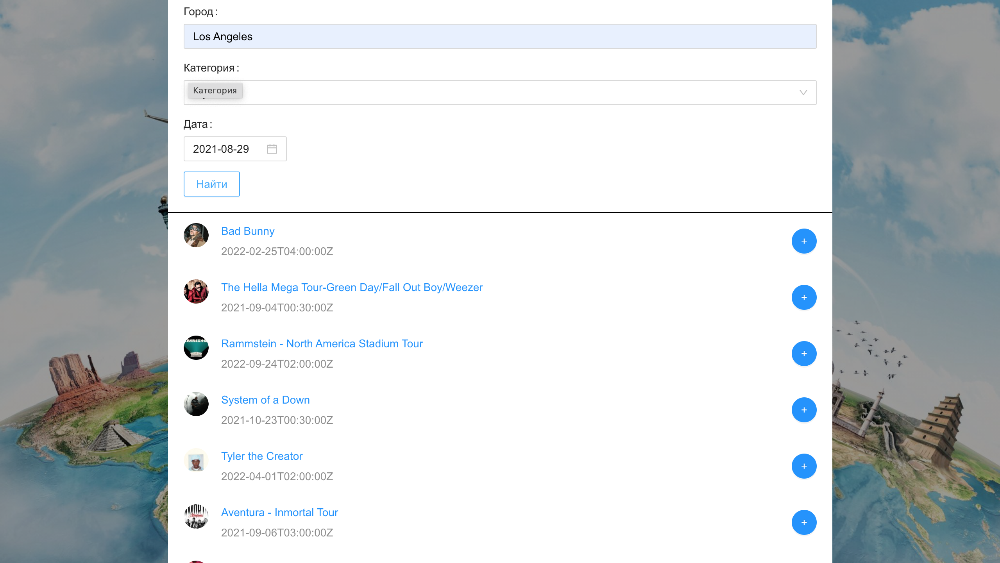

# Event-worldwide

Приложение по поиску мероприятий и событий, покупка билетов, во многих крупных городах мира.

Введение
-----------


Рисунок 1. Главная страница


Рисунок 2. Избранные события

Функциональность
-----------

В данном приложении вы можете искать интересные события по разным параметрам, добавлять их к себе в избранное, получать уведомления об избранных мероприятиях в Telegram.


Рисунок 3. Страница поиска событий

В планах
Мобильная версия приложения на react-native
Возможность коммуникаций между пользователями.

Запуск
-----------
В папках 
/backend
/frontend
запустить команду

```
npm i
npm start
```
В папке 
/event_worldwideBot
```
npm i
npm start
